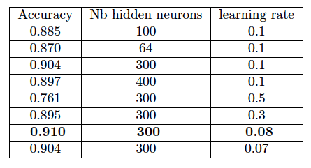
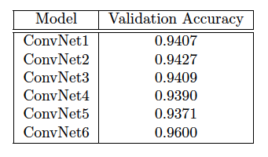

# Find-the-Largest-Digit
Use machine learning algorithm to recognize the largest digit in an image.

# Introduction

The goal of the project was to design a machine learning algorithm that may recognize the largest digit in an image. The problem of recognizing the largest hand-written digit by area in an image is a variant of the classic machine learning problem of classifying a digit in an image. Three approaches were taken to solve this problem. We trained a baseline logistic regression model, a simple feed-forward neural network model and several tuned convoluntinal neural network models. 
The validation accuracy of the logistic regression model was around 70%.The validation accuracy of the feed-forward neural network was 90%. A third approach was attempted with convolutional neural networks(CNN) using the Keras framework and the best validation accuracy achieved was approximately 96%.

# Data Preprocessing

# Methodology

- Logistic regression

The logistic regression model was implemented using scikit-learn library.

- Feed Forward Neural Network

A feed forward neural network was implemented by hand. We took sigmoid function as activation function for the hidden layer and the output layer. To train the model, we use stochastic gradient descent over 12 epochs. Two hyperparameters were considered: the number of neurons in the hidden layer and the learning rate.

- Convolutional Neural Network

Hyperparameter tuning focused on surveying if significant changes to the architecture of the LeCun-5CNN would lead to improvements in accuracy.

# Results
- Linear methods

The logistic regression gives out a baseline linear model and result for further work. The model is trained with all default parameter settings and the accuracy is 0.728 on validation set.

- Feed Forward Neural Network

The table below depicts how the feed forward neural network performs with different values of the learning rate and the number of hidden neurons.

- Convolutional Neural Network

All architectures were tested through batch training of two hundred samples at a time for 20 epochs. 

